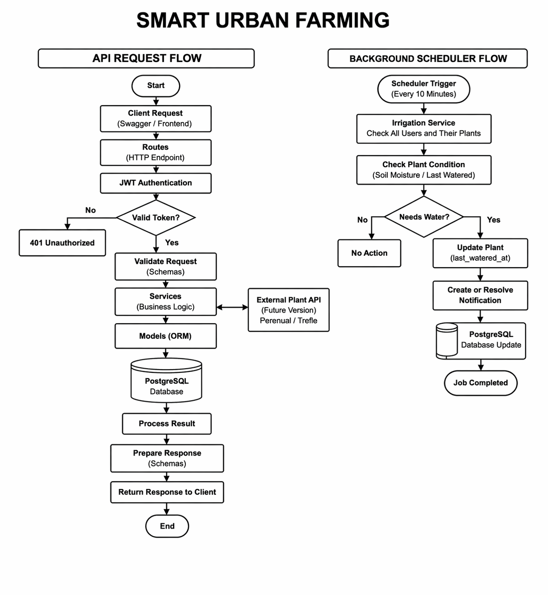

# 🌱 Smart Urban Farming System (beta version)

A scalable smart urban farming platform designed to provide plant care recommendations, plant data management, and future AI-based monitoring and smart agriculture solutions.

This project implements a modular backend using **FastAPI** and **PostgreSQL**, integrates real-world plant databases, and is designed for future **AI and IoT expansion**.

---

## 📌 Repository

GitHub: https://github.com/xueshuijing/Smart_Urban_Farming_System

---

## 🎯 Project Goals

- Build a smart plant care management system  
- Provide plant watering and sunlight recommendations  
- Store and manage plant data  
- Integrate external plant databases for companion planting recommendations  
- Support AI-based plant analysis  
- Enable smart urban farming research  
- Develop a scalable agriculture platform  

---

## 🧠 System Overview

The system follows a **modular and scalable architecture**:

- FastAPI backend  
- PostgreSQL database  
- External plant APIs  
- Streamlit dashboard  
- Future AI and IoT integration  

The project starts as a **working MVP** and evolves into a **smart agriculture research platform**.

---

## 🏗️ Architecture

### Version 1 (MVP)



**Focus:**

- FastAPI backend  
- PostgreSQL database  
- Plant data management  
- Perenual API integration  
- Smart irrigation logic  

---

## 🛠️ Technology Stack

### Backend
- FastAPI  
- Python  
- Uvicorn  

### Database
- PostgreSQL  
- SQLAlchemy  

### External APIs
- Perenual API  
- Trefle API (future)  

### Frontend
- Streamlit  

### Future Expansion
- Machine Learning  
- IoT Sensors  
- Cloud Infrastructure  
- Smart Irrigation  

---

## 📂 Project Structure

```
smart-farming-system/
│
├── backend/
│ ├── main.py # FastAPI entry point
│ ├── alembic/ # Database migrations
│ ├── app/
│   ├── core/ # Config, security, logging
│   ├── api/ # API routes (v1)
│   ├── database/ # Database connection
│   ├── models/ # Database models
│   ├── schemas/ # Data validation
│   ├── services/ # Business logic
│   ├── ai/ # AI features
│   ├── integrations/ # External APIs / IoT
│   ├── workers/ # Background tasks
│   └── utils/ # Helper functions
│
├── frontend/
│ └── streamlit_app.py # Streamlit UI
│
├── docs/ # Documentation
├── tests/ # Tests
├── logs/ # Application logs
├── requirements.txt
└── README.md

```

---

## 📁 Folder Description

| Folder | Purpose |
|--------|--------|
| backend/main.py | Application entry point |
| backend/app/api | API routes |
| backend/app/services | Business logic |
| backend/app/models | Database models |
| backend/app/schemas | Data validation |
| backend/app/core | Config, security, logging |
| backend/app/database | DB connection |
| docs | Architecture documentation |
| frontend | Streamlit dashboard |
| tests | Unit and integration tests |

---

## ⚙️ Installation

### 1️⃣ Clone Repository

```bash
git clone https://github.com/xueshuijing/Smart_Urban_Farming_System.git
cd Smart_Urban_Farming_System

```

---

### 2️⃣ Create Virtual Environment

```bash
python3 -m venv venv
source venv/bin/activate
```

---

### 3️⃣ Install Dependencies

```bash
pip install -r requirements.txt
```

---

### 4️⃣ Setup PostgreSQL

Create database:

```bash
createdb smart_farming
```

or

```sql
CREATE DATABASE smart_farming;
```

---

### 5️⃣ Run FastAPI

```bash
uvicorn backend.app.main:app --reload
```

---

### 6️⃣ Open API Documentation

```
http://127.0.0.1:8000/docs
```

This opens the **Swagger API interface** for testing endpoints.

---

## 🔌 API Example

### Get All Plants

```
GET /plants
```

---

### Get Plant by ID

```
GET /plants/{id}
```

---

### Add Plant

```
POST /plants
```

---

## 📊 Streamlit Dashboard

Run frontend:

```bash
streamlit run frontend/streamlit_app.py
```

---

## 📚 Documentation

Detailed documentation is available in the **docs** folder.

- Technology Selection → `docs/technology-selection.md`
- System Architecture → `docs/system-architecture.md`

---

## 🚀 Version Roadmap

### Version 1 (MVP)

- FastAPI backend
- PostgreSQL database
- Perenual API
- Irrigation + notifications

---

### Version 2

- Streamlit dashboard
- Trefle integration
- AI plant recommendation
- Cloud deployment

---

### Version 3

- IoT sensors
- Smart irrigation automation
- Predictive analytics

---

## 🎯 Design Principles

- Modular architecture
- Scalable system
- Data-driven decisions
- Real-world usability
- Clean engineering practices

---

## 🔮 Future Improvements

- Web dashboard
- Mobile application
- Plant image recognition
- Environmental monitoring
- AI plant health prediction
- Smart agriculture analytics

---

## 📜 License

Open-source for educational and research purposes

---

## 👤 Author

**Smart Urban Farming Project**  
AI & Smart Agriculture Portfolio
GitHub: https://github.com/xueshuijing
